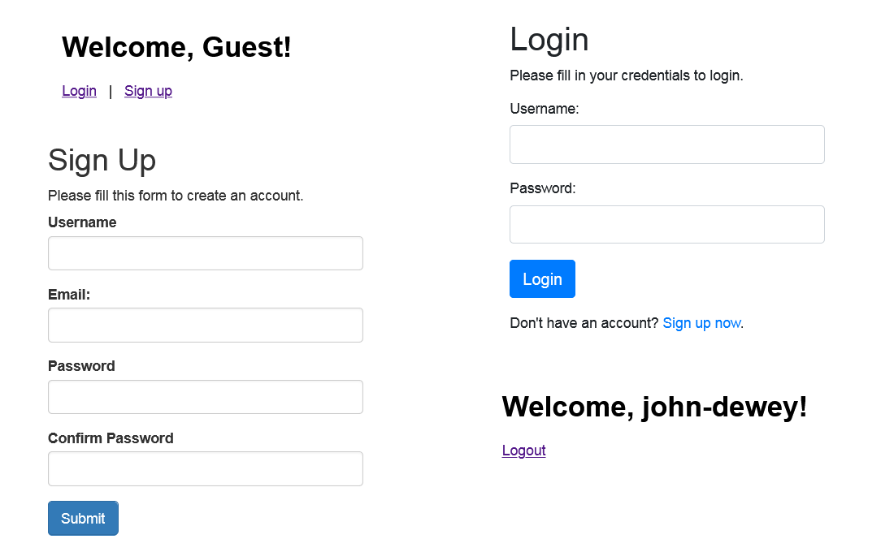

# Simple User Authentication System
A basic user registration and login system built with PHP, HTML, jQuery, AJAX, JSON, Bootstrap, CSS, and MySQL. This project demonstrates a simple yet secure way to handle user authentication, including registration, login, and session management.

**Topics:** `php`, `mysql`, `ajax`, `json`, `bootstrap`, `jquery`, `css`, `user authentication`, `user registration`, `user-login`, `session management`



### Install Process

1. **Clone the repository:**
   ```sh
   git clone https://github.com/yourusername/simple-user-authentication-system.git
   ```

2. **Navigate to the project directory:**
   ```sh
   cd simple-user-authentication-system
   ```

3. **Set up the database:**
    - Create a MySQL database named `user_authentication`.
    - Import the provided SQL file to create the necessary table:
      ```sh
      mysql -u yourusername -p user_authentication < db/database.sql
      ```

4. **Update the database configuration:**
    - Copy `config.sample.php` to `config.php`:
       ```sh
       cp config.sample.php config.php
       ```
    - Open `config.php` and update the database configuration details.

5. **Start the development server:**
   ```sh
   php -S localhost:8000
   ```

6. **Access the application:**
    - Open your web browser and navigate to `http://localhost:8000`.


### File Structure

Here’s a basic file structure for your simple-user-authentication-system application:

```
simple-user-authentication-system/
│
├── backend/
│   └── index.php
│
├── assets/
│   ├── css/
│   │   └── style.css
│   └── js/
│       └── script.js
│
├── db/
│   └── database.sql
│
├── includes/
│   ├── config.sample.php
│   ├── db.php
│   ├── login.php
│   ├── logout.php
│   └── register.php
│
├── src/
│   ├── login.php
│   ├── logout.php
│   └── register.php
│
├── index.html
├── register.html
├── login.html
├── README.md
└── .gitignore
```